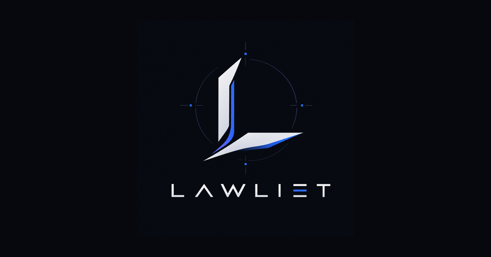

<div align="center">



### The demo site for Lawliet

A single-page, zero-build landing page for **[Lawliet](https://github.com/sarat1kyan/lawliet)**,
the self-hosted compliance and security operations platform. Import this repository into
Netlify and it deploys as-is, demo booking form included.

[](https://www.netlify.com/)
[](#deploy-to-netlify)
[](LICENSE)

</div>

---

## What this is

This repository is the marketing / demo front for the Lawliet product. It is deliberately
plain: hand-written HTML, one CSS file, one JS file, no framework, no build step, no
dependencies to install. That keeps it fast, auditable, and trivial to host anywhere that
serves static files.

The product itself lives in a separate repository and is not included here.

## Deploy to Netlify

Two ways, both zero-config.

**From the dashboard**

1. Push this repository to your GitHub account (already done if you are reading it there).
2. In Netlify: **Add new site -> Import an existing project -> GitHub**, and pick this repo.
3. Leave the build command empty and the publish directory as the repository root. The
   included `netlify.toml` already sets `publish = "."`, so you can just click **Deploy**.
4. Done. Netlify serves `index.html` and picks up the demo form automatically.

**From the CLI**

```bash
npm i -g netlify-cli
netlify deploy --prod --dir .
```

## The demo booking form

The **Book a demo** form uses [Netlify Forms](https://docs.netlify.com/forms/setup/). It
works with no backend: on deploy, Netlify detects the form from the static HTML
(`data-netlify="true"` plus the hidden `form-name` field) and captures every submission.

- Read submissions in the Netlify dashboard under **Forms -> demo-request**.
- Turn on email or Slack notifications there to get pinged on each request.
- A honeypot field (`company-website`) is wired up to drop bots silently.

No API keys, no third-party service, nothing to rotate.

## Local preview

No tooling required. Any static file server works:

```bash
python3 -m http.server 8080
# then open http://localhost:8080
```

Note: the demo form only records submissions once deployed on Netlify. Locally it will
post and show the success state without persisting anything, which is expected.

## Structure

```
index.html            the whole landing page
404.html              styled not-found page
netlify.toml          publish dir, headers, redirects
robots.txt
assets/
  css/styles.css      design system and layout
  js/main.js          nav, reveals, counters, heartbeat terminal, form submit
  img/                brand mark, banner, favicons
```

## Design

Mirrors the Lawliet console: graphite surfaces, a single electric-blue accent, blade-sharp
corners, and mono type for signal text. Fonts are Space Grotesk, Inter and JetBrains Mono,
loaded from Google Fonts. Respects `prefers-reduced-motion` and `prefers-color-scheme`.

## Customizing

- **Copy and sections**: all in `index.html`, top to bottom in reading order.
- **Colors, spacing, type**: the tokens at the top of `assets/css/styles.css`.
- **Links**: repository and docs links point at `github.com/sarat1kyan/lawliet`.
- **Form fields**: edit the `<form>` in `index.html`; Netlify picks up new fields on the
  next deploy automatically.

## License

MIT. See [LICENSE](LICENSE).
